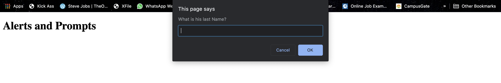

##### 

Today, **JavaScript** powers the entire modern internet. Together with html and css, javascript has been one of the three core technologies of web development. 

Initially, javascript was only used in browser environment, limiting it to only Client Side Language. But, with the arrival of newer technologies like NodeJS, JavaScript is now used for Server Side Development as well.

As mentioned on [MDN Web Docs](https://developer.mozilla.org/en-US/docs/Web/JavaScript):

>JavaScript® (often shortened to JS) is a lightweight, interpreted (or just-in-time compiled), object-oriented language with first-class functions.

#### Timeline of JavaScript

During the formative years of the Internet, web pages could only be static, lacking the capability for dynamic behavior after the page was loaded in the browser. There was a desire in the burgeoning web development scene to remove this limitation, so in 1995, Netscape decided to add a scripting language to Navigator. 

At Netscape, it was decided to devise a new language, with syntax similar to Java and less like Scheme or other extant scripting languages. Although the new language and its interpreter implementation were officially called LiveScript when first shipped as part of a Navigator release in September 1995, the name was changed to JavaScript three months later.

>
>First appeared	in December 4, 1995.
>
>**1996:** Changed from LiveScript to JavaScript to attract Java developers. JavaScript has almost nothing to do with Java.
>
>**1997:** ES1 (ECMAScript 1) became the first version of the JavaScript language standard.
>
>**2009:** ES5 (ECMAScript 5) was released with lots of new features.
>
>**2015:** ES6/ES2015 (ECMAScript 2015) was released: the biggest update to the language ever!
>
>>In 2015, it was decided to change to an annual release cycle 

- In the subsequent years, the versions were released annualy with smaller updates. 
  - 2016: Release of ES2016
  - 2017: Release of ES2017
  - 2018: Release of ES2019
  - 2019: Release of ES2019

>**ECMAScript:** The language standard; **JavaScript:** The language in practice.


#### Data Types and Variables

In JS, there are five different **Primitive Data Types**:

1. **Number:** _Floating point numbers, for decimals and integers_
2. **String:** _Sequence of characters, used for text_
3. **Boolean:** _Logical data type that can only be `true` or `false`_
4. **Undefined:** _Data type of a variable that does not have a value yet_
5. **Null:** _Also means ‘non-existent’_

>**JavaScript has a feature called dynamic typing. That means, data types are automatically assigned to variables.**

Primitive Data Types are not meant for Objects.

There are few rules for declaring **Variables** in javascript:

1. All variable names must start with either an underscore '_', a dollar sign '$', or a letter.
2. Symbols must not be used anywhere in between the variable name. Eg. dwane/johnson
3. Reserve JavaScript keywords like `delete` or `if` can not be used as variable names.   

#### Variable Mutation and Type Coercion

Due to the dynamic typing feature, variables can be mutated on the go without the need to redeclare them.

```js
var firstName = 'Dwayne';
var age = 26;       //data type: number

var job, isMarried;
job = 'wrestler';
isMarried = false;

age = 'twenty six'; //data type: string (no need to redeclare age as string)
job = 'actor';

console.log(firstName + ' is a ' + age + ' year old ' + job + '. Is he married? ' + isMarried);
```
Here, js will automatically assign the age from a number value to a string value without redeclaring it, known as variable mutation, credit to dynamic typing.

JavaScript automatically converts types from one another as needed, famously known as **Type Coercion**.
```js
var firstName = 'Dwayne';
var age = 26;

console.log(firstName + ' ' + age); //age data type: string
```

Here, js will automatically convert the age from a number data type to a string data type, in order to join it with firstName. It does type coercion with booleans and undefined as well.

#### Operator Precedence

This is the [Operator Precedence Table](https://developer.mozilla.org/en-US/docs/Web/JavaScript/Reference/Operators/Operator_Precedence) by Mozilla Developer Network. In the table, higher value attributes to higher precedence.


---


<!--- 

#### Alerts and Prompts

Alert will pop up a small window also known as alert window, and it will ask user to continue before finishing the loading of the page.

```js
alert(firstName + 'is a' + age + 'year old' + job + '. Is he married?' + isMarried);
```


Prompt is used to ask data from user in similar manner like alert, with the difference being the input field provided to user to get data. This data can be stored in a variable as below.
```js
var lastName = prompt('What is his last Name?');

```

-->