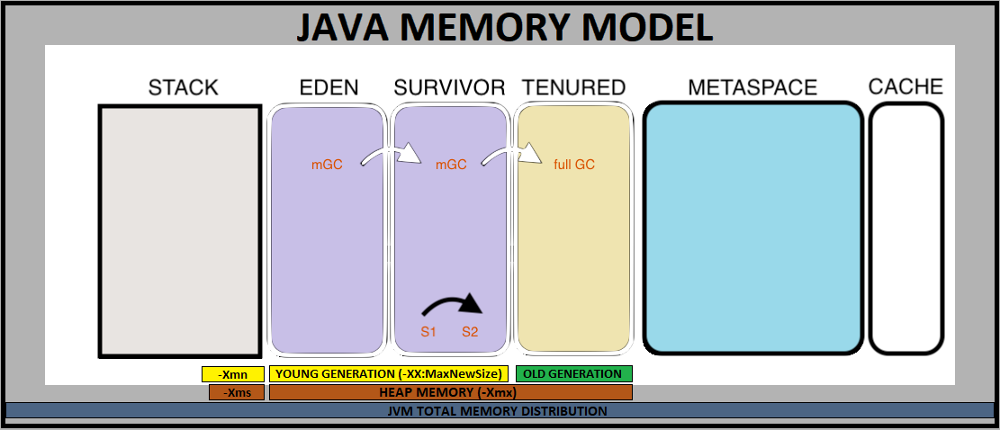

#### Java Memory Model

**JVM** requires some memory for its functioning. This memory is consumed from the available memory on host OS. This can be managed programmatically by providing it in startup parameters to jvm. Inside JVM, there exist separate memory spaces **(Heap, Non-Heap, and Cache)** in order to store runtime data and compiled code.

- In the image shown above for Java Memory Model:
  - Heap Space: Eden + Survivor + Tenured
  - Non-Heap Space: Stack + MetaSpace + Reserved (Not shown here)
  - Cache

#### Heap Memory

This is the place where objects live. Prior to Java 8, we have Permanent Generation also as part of Heap. But Java 8 onwards, this has been replaced with a non-heap memory named as MetaSpace. After Java 8, Heap Space is divided into below two parts:

- #### Young Generation
The Young Generation is the place where all the new objects are created. When this young generation is filled, garbage collection is performed. This garbage collection is called Minor GC. Young Generation is divided into three parts – **Eden and two Survivor(S1, S2) Memory Spaces**. All newly created objects are located in the Eden memory space. 

- #### Old Generation
Objects that are survived after many cycles of GC, are moved to the Old Generation memory space, also known as **Tenured Space**. Usually, it’s done by setting a threshold (-XX:MaxTenuringThreshold) for the age of the young generation objects before they become eligible to be promoted to Old generation.

>
Followings are some JVM memory configurations when running resource-intensive Java programs.
- -Xms`value` - Sets the minimum or initial Heap size
- -Xmx`value` - Sets the maximum Heap size (def: 256m) The -Xmx option is equivalent to -XX:MaxHeapSize.
- -Xmn`value` - Sets the initial and maximum size (in bytes) of the heap for the young generation, rest of the space goes for old generation. Instead of the -Xmn option to set both the initial and maximum size of the heap for the young generation, you can use -XX:NewSize to set the initial size and -XX:MaxNewSize to set the maximum size.
- -XX:NewSize=`size` - Sets the new generation heap size
- -XX:MaxNewSize=`size` - Sets the maximum new generation heap size
- -XX:PermSize=`size` - Sets the space (in bytes) allocated to the permanent generation
- -XX:MaxPermSize=`size` - Sets the maximum permgen space size (in bytes). This option was deprecated in JDK 8, and superseded by the -XX:MaxMetaspaceSize option.
- -XX:SurvivorRatio=`value` - Sets new heap size ratios (e.g. if Young Gen size is 10m and memory switch is –XX:SurvivorRatio=2, then 5m will be reserved for Eden space and 2.5m each for both Survivor spaces, def: 8)
- -XX:NewRatio=`value` - Sets ratio of Old/New Gen sizes (def: 2, means 2/3 of memory for Old, 1/3 for Young)
- -XX:MaxTenuringThreshold=`value` - Sets GC threshold for promoting to Old Generation. The largest value is 15. The default value is 15 for the parallel (throughput) collector, and 6 for the CMS collector. 

#### Non Heap Memory
The memory that doesn't belong to Heap Area, is informally referred as Non-Heap Memory. This area includes **Stack** and **MetaSpace**.

- #### Stack
This memory is used for execution of a thread and it contains method specific values and references to other objects in Heap.

- #### MetaSpace

  From Java 8 onwards, Permanent Generation has been replaced with MetaSpace, which is a non-heap memory. MetaSpace holds the reflective data of JVM itself, like Class Loader related data, Class metadata, methods and more.

  MetaSpace is not a contiguous memory and can auto increase its size up to the limit that underlying OS allows, whereas Perm Gen always has a fixed maximum size. As long as the classloader is alive, the metadata remains alive in the Metaspace and can’t be freed.

- #### Reserved Space
  Jvm has its some reserved memory space for variety of purposes.

#### Code Cache

  Code Cache is cache memory, that is used for the storage of compiled native codes generated by JIT compiler, JVM internal structures, loaded profiler agent code and data, etc.

---

#### Garbage Collection

Unlike languages like C, C++, where developers have to take care of the memory management of their programs on their own, Java has feature of **automatic memory management**, called as **Garbage Collection**. 

It's a thread running in background that looks into memory and finds out those objects that are not referenced anymore by any part of the program. These unreferenced Objects are deleted, and the space is reclaimed for allocation to other objects.

>
**GC is based on a couple of hypothesis:**
1. Most objects soon become unreachable.
2. References from 'old' objects to 'young' objects only exist in small numbers.

GC is carried out by daemon thread known as Garbage Collector. There is no way to force guaranteed GC to happen explicitly. Although there are API's available like System.gc() to trigger the GC, but the final decison resides with JVM.

If new allocations can not happen due to no free memory available on heap, it will throw **java.lang.OutOfMemoryError heap space**.

Garbage Collection is Generational, the gc that runs in Young Generation is called **minor Garbage Collection** and the one that runs on entire heap, is called the **full Garbage Collection**. 

>
A typical full GC involves following three steps:
1. **Mark**: Starts from root node of your application(main), walks the object graph, marks objects that are reachable as live
2. **Sweep or Delete:** Delete unreachable objects
3. **Compacting**: Compact the memory by moving around the objects and making the allocation contiguous than fragmented.

  - Since the newly created objects are always placed in Eden Space, once this space becomes full, any new allocation fails. Hence minor GC kicks in moving all marked live objects to Survivor Spaces and all remaining dead objects are deleted, emtying the Eden Space.
  - Next minor GC also checks in for live objects in first survivor space and moves them to the other survivor space, and empties the first survivor space by freeing up the unreferenced objects, and vice-versa. So at a time, one of the survivor space is always empty. Thus, having two survivor spaces save one extra step of Compacting in minor GC by moving fragmented objects alternatively in contiguous locations in survivor spaces.
  - Live objects are moved back and forth in alternate Survivor Spaces until the Objects survive a threshold number of GCs, after which all surviving objects are promoted to next generation, called as Old Generation.
    
    -XX:MaxTenuringThreshold : switch to set the GC threshold for promoting to Old Generation 

Once the Old Generation is almost full, the full GC kicks in, which runs on entire Heap from Young Generation to Old Generation and performs **mark**, **sweep** and **compacting**. And this GC is more expensive in terms of resources, as performing full GC on entire Heap requires more efforts and is slower, compared to performing minor GC on Young Generation which is quick because it runs only on a section of Heap Space (eden space and survivor space). 

Although the operation in minor GC is quick and not that intrusive, so it doesn't really seem like halting the application but irrespective of that, all GC's are **“Stop the World”** events because all application threads are stopped until the GC operation completes. 

#### Application Performance with respect to GC

- **Responsiveness or latency**

  It is the time taken by an Application to respond with a requested piece of data. E.g. how quickly a desktop UI responds to an event, or a website returns a page.

  For Applications that focus on responsiveness, large pause times are not acceptable. The focus is on responding in short period of time.

- **Throughput**
  
  It is the maximum amount of work done by Application in a specific period of time. E.g. the number of transactions completed in a given time.

  High pause times are acceptable for applications that focus on throughput. Since high throughput applications focus on benchmarks over longer periods of time, quick response time is not a consideration.

#### Garbage Collection Types

There are basically five types of garbage collectors that we can use in our applications. We just need to use the JVM switch to enable the garbage collection strategy for the application. Let’s look at each of them one by one.

- **Serial GC (-XX:+UseSerialGC):** Serial GC is a very basic GC that comes with Java, uses the simple mark-sweep-compact approach using single thread. It is good for small applications with low memory footprint.

- **Parallel GC (-XX:+UseParallelGC):** Parallel GC is same as Serial GC except that is spawns N threads for young generation garbage collection where N is the number of CPU cores in the system. We can control the number of threads using -XX:ParallelGCThreads=n JVM option. Parallel Garbage Collector is also called throughput collector because it uses multiple CPUs to speed up the GC performance. Parallel GC uses a single thread for Old Generation garbage collection.

- **Parallel Old GC (-XX:+UseParallelOldGC):** This is same as Parallel GC except that it uses multiple threads for both Young Generation and Old Generation garbage collection.

- **Concurrent Mark Sweep (CMS) Collector (-XX:+UseConcMarkSweepGC):** CMS Collector is also referred as concurrent low pause collector. It does the GC for the Old generation and tries to minimize the pauses due to GC by doing most of the garbage collection work concurrently with the application threads without waiting for the Old Generation to get full. It does not pauses the application for most of the GC opeartions. It only pasuses for Mark/Remark step. CMS collector on the young generation uses the same algorithm as that of the parallel collector. This garbage collector is suitable for responsive applications where we can’t afford longer pause times. We can limit the number of threads in CMS collector using -XX:ParallelCMSThreads=n JVM option. It is the most favored GC for most of the Web and Financial Applications.

- **G1 Garbage Collector (-XX:+UseG1GC):** The Garbage First or G1 garbage collector is available from Java 7 and its long term goal is to replace the CMS collector. The G1 collector is a parallel, concurrent, and incrementally compacting low-pause garbage collector. Garbage First Collector doesn’t work like other collectors and there is no concept of Young and Old generation space. It divides the heap space into multiple equal-sized heap regions. When a garbage collection is invoked, it first collects the region with lesser live data, hence “Garbage First”. You can find more details about it at Garbage-First Collector Oracle Documentation.

#### Enabling GC Logging

If the GC is behaving suspiciously, and performnace with respect to GC needs to be analyzed then below logging switches can be enabled:
  -  -verbose:gc
  -  -XX:+PrintGCDetails
  -  -Xloggc:gc.log

#### GC Tools

There are some tools that can be used for the GC aid:
- Garbage Collection Log Analyzer from IBM
- VisualVM : free tool that comes with jdk instalation, command: jvisualvm (a helpful plugin visualgc)
- Java Heap Analysis Tool (jhat)
- TerraCotta Big Memory

---

#### Java Virtual Machine Technology

The JDK provides one or more implementations of the Java™ virtual machine (VM):  
- On platforms typically used for client applications, the JDK comes with a VM implementation called the Java HotSpot™ Client VM (client VM). The client VM is tuned for reducing start-up time and memory footprint. It can be invoked by using the -client command-line option when launching an application.
- On all platforms, the JDK comes with an implementation of the Java virtual machine called the Java HotSpot Server VM (server VM). The server VM is designed for maximum program execution speed. It can be invoked by using the -server command-line option when launching an application.
Some features of Java HotSpot technology, common to both VM implementations, are the following.

  - Adaptive compiler - Applications are launched using a standard interpreter, but the code is then analyzed as it runs to detect performance bottlenecks, or "hot spots". The Java HotSpot VMs compile those performance-critical portions of the code for a boost in performance, while avoiding unnecessary compilation of seldom-used code (most of the program). The Java HotSpot VMs also use the adaptive compiler to decide, on the fly, how best to optimize compiled code with techniques such as in-lining. The runtime analysis performed by the compiler allows it to eliminate guesswork in determining which optimizations will yield the largest performance benefit.
  - Rapid memory allocation and garbage collection - Java HotSpot technology provides for rapid memory allocation for objects, and it offers a choice of fast, efficient, state-of-the-art garbage collectors.
  - Thread synchronization - The Java programming language allows for use of multiple, concurrent paths of program execution (called "threads"). Java HotSpot technology provides a thread-handling capability that is designed to scale readily for use in large, shared-memory multiprocessor servers.

#### Brief overview of Hotspot JVM Architecture:

>
##### Sources: 
>
- Orcale JDK Documentations
>
Few More Important Resources that can be checked out:
   - [Table for Oracle JavaSE VM Options (SE 7 and Earlier)](https://www.oracle.com/java/technologies/javase/vmoptions-jsp.html)
   - [All Java Hotspot VM command line flags for Java 8](https://docs.oracle.com/javase/8/docs/technotes/tools/unix/java.html)
   - [All Java Hotspot VM command line flags for Java 7](https://docs.oracle.com/javase/7/docs/technotes/tools/solaris/java.html)
   - [Oracle JVM Troubleshooting Memory](https://www.oracle.com/webfolder/technetwork/tutorials/mooc/JVM_Troubleshooting/week1/lesson1.pdf)
   - [Sun Java System Application Server Enterprise Edition 8.2 Performance Tuning Guide](https://docs.oracle.com/cd/E19900-01/819-4742/index.html)
   - [Guidelines for Java SE 8.2 Heap Sizing](https://docs.oracle.com/cd/E19900-01/819-4742/abeij/index.html)
   - [Java SE 8.2 Heap Tuning Parameters](https://docs.oracle.com/cd/E19900-01/819-4742/abeik/index.html)
   - [All Java Platform, Standard Edition Documentation](https://docs.oracle.com/en/java/javase/index.html)
   - [JDK 14 Documentation](https://docs.oracle.com/en/java/javase/14/)
   - [Java Platform, Standard Edition HotSpot Virtual Machine Garbage Collection Tuning Guide](https://docs.oracle.com/javase/9/gctuning/introduction-garbage-collection-tuning.htm#JSGCT-GUID-326EB4CF-8C8C-4267-8355-21AB04F0D304)

