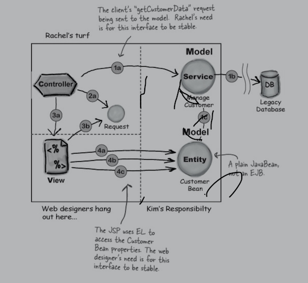
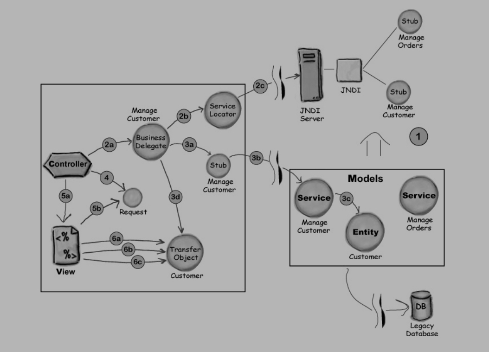

## Enterprise Design Patterns

You can exploit the collective wisdom of the tens of thousands of developers who’ve been down that road. Using both J2EE-specific and other design patterns, you can can simplify your code. And the most significant design pattern for web apps, MVC, even has a wildly popular framework, Struts, that’ll help you craft a flexible, maintainable servlet Front Controller.

Adding more computers to a tier of functionality is known as horizontal scaling , and is considered one of the best ways to increase throughput.

Most of the software for a big web application lives in either the “Web Tier” or the “Business Tier”.
This is an example blog post. All your blog posts should be here: `content/posts`.

A software design pattern is “a reusable solution for a commonly-occuring software problem.”

#### Website Expectations

The most important job for a web app is to provide the end user with a reliable, useful, and correct experience. In other words, the program must satisfy below two requirements:

1.  Functional Requirements
    - business functions (add items to shopping cart etc)
1.  Non-Functional Requirements (for what happens behind the scenes)
    - Performance
    - Modularity
    - Flexibility
    - Maintainability
    - Extensibility

#### Common Vernaculars of Software Design Principles

- **Code to Interfaces**  
  An interface is a kind of a contract between two objects. When a class implements an interface, it’s saying in effect: “My objects can speak your language.” Another huge benefit of interfaces is polymorphism . Many classes can implement the same interface. The calling object doesn’t care who it’s talking to as long as the contract is upheld. For example, the web container can use any component that implements the Servlet interface.

- **Separation of Concerns and Cohesion**  
  We all know that when we specialize the capabilities of our software components, they get easier to create, maintain, and reuse. A natural fallout of separating concerns is that cohesion tends to increase. Cohesion means the degree to which a class is designed for one, cohesive, task or purpose.

- **Hide Complexity**
  Hiding complexity often goes hand in hand with separating concerns. For instance if your system needs to communicate with a lookup service, it’s best to hide the complexity of that operation in a single component, and allow all the other components that need access to the lookup service to use that specialized component. This approach simplifies all of the system components that are involved.

- **Loose Coupling**  
  By their very nature, OO systems involve objects talking to each other. By coding to interfaces, you can reduce the number of things that one class needs to know about another class to communicate with it. The less two classes know about each other, the more loosely coupled they are to each other. A very common approach when class A wants to use methods in class B is to create an interface between the two. Once class B implements this interface, class A can use class B via the interface. This is useful, because later on you can use an updated class B or even an entirely different class, as long as it upholds the contract of the interface.

- **Remote Proxy**  
  Today, when a web site grows, the answer is to lash together more servers, as opposed to upgrading a single, huge, monolithic server. The outcome is that Java objects on different machines, in their own separate heaps, have to communicate with each other. Leveraging the power of interfaces, a remote proxy is an object local to the “client” object that pretends to be a remote object. (The proxy is remote in that it is remote from the object it is emulating.) The client object communicates with the proxy, and the proxy handles all the networking complexities of communicating with the actual “service” object. As far as the client object is concerned, it’s talking to a local object.

- **Increase Declarative Control**  
  Declarative control over applications is a powerful feature of J2EE Containers. Most commonly, this declarative control is implemented using the application’s deployment descriptor (or DD). Modifying the DD gives us the power to change system behaviors without changing code. The DD is an XML file that can be maintained and updated by non-programmers. The more that we write our web applications to leverage the power of the DD, the more abstract and generic our code becomes.

#### Patterns for Remote Model Components

While the MVC components are running on one JVM, as long as the business guys keep the interfaces to their model components consistent, everyone will be happy. The two key interface points in their design are when the controller first interacts with a model component (steps 1 and 2 below), and then later, when a JSP view interacts with the bean it needs (steps 3 and 4 below). Getting customer data for a client...



1. Having received a request for customer information, the Controller calls the ManageCustomer service component (a Model ). The service component does a JDBC call to the legacy database, then creates a Customer bean (this is NOT an EJB, just a plain old JavaBean), populated with customer data from the database.
2. The Controller adds the Customer bean reference to the request object, as an attribute.
3. The Controller forwards to the View JSP. The JSP gets the reference to the Customer bean from the request object.
4. The View JSP uses EL to get the Customer Bean properties it needs to satisfy the original request.

Things are fairly simple when all the web app components (model, view, controller) are on the same server, running in the same JVM. It’s just plain old Java, get a reference, call a method.

**But, the big question is what to do when model components are remote to the web app?**

Java and J2EE provide mechanisms that handle two of the most common difficulties that arise when objects need to communicate across a network locating remote objects, and handling all the low level network/IO communications between local and remote objects.  
(In other words, how to find remote objects, and how to invoke their methods.)  


- JNDI, and
- RMI

#### JNDI in a nutshell

JNDI stands for Java Naming and Directory Interface, and it’s an API to access naming and directory services. JNDI gives a network a centralized location to find things. If you’ve got objects that you want other programs on your network to find and access, you register your objects with JNDI. When some other program wants to use your objects, that program uses JNDI to look them up.

JNDI makes relocating components on your network easier. Once you’ve relocated a component, all you need to do is tell JNDI the new location. That way, other client component only need to know how to find JNDI, without knowing where the objects registered with JNDI are actually located.

#### RMI in a nutshell

RMI stands for Remote Method Invocation, a mechanism that greatly simplifies the process of getting objects to communicate across a network.

Let’s say you'r a “business guy”, and you want to make an object available to remote clients. Using RMI, you’ll create a proxy and you’ll register your object with some sort of registry. Any client who wants to call your methods will do a lookup on the registry and get a copy of the remote proxy. Then the client will make calls on the remote proxy, pretending it’s the real thing. The remote proxy (called a stub ), handles all the communications details like sockets, I/O streams, TCP/IP, serializing and deserializing method arguments and return values, handling exceptions, and so forth.

(Oh, by the way, there’s usually a proxy on the server side (often called a “ skeleton ”), doing similar chores on the server side where the remote object lives.)

Just a little more RMI review

Without doing an entire RMI tutorial, we’ll look at a few more high level RMI topics to make sure we’re all talking the same talk. Specifically, we’ll look at the server side and client side of using RMI.

RMI on the Server side in 4 steps  
(An overview of the steps to make a remote model service that runs on the server.)

1. Create a remote interface . This is where the signature for methods like getCustData() will reside. Both the stub (proxy) and the actual model service ( the remote object ) will implement this interface.
2. Create the remote implementation , in other words, the actual model object that will reside on the model server. This includes code that registers the model with a well-known registry service such as JNDI or the RMI registry.
3. Generate the stub and (possibly) skeleton. RMI provides a compiler called rmic that will create the proxies for you.
4. Start/run the model service (which will register itself with the registry and wait for calls from far-away clients).

The client side, with and without RMI  
Let’s compare the pseudo-code of a client using RMI to the pseudo-code of a client NOT using RMI.

The client without RMI

```java
public void goClient() {
  try {
    // get a new Socket
    // get an OutputStream
    // chain it to an ObjectOutputStream
    // send an opcode & op arguments
    // flush OS
    // get the InputStream
    // chain it to an ObjectInputStream
    // read the return value and/or
    // handle exceptions
    // close stuff
  } // catch and handle remote exceptions
}
```

The client with RMI

```java
public void goClient() {
  try {
    // lookup the remote object (stub)
    // call the remote object's method
  } // catch and handle remote exceptions
}
```

#### Adding RMI and JNDI to the controller

Let’s focus on what we need to do to keep Rachel’s life as simple as possible. In other words, what impact does adding JNDI and RMI have on the controller?

3 steps to using a remote object

1. Kim, the model guy, registers his model component with the JNDI service.
2. When Rachel’s controller gets a request, the controller code does a JNDI lookup to get the stub proxy for Kim’s remote model service.
3. The controller makes business method calls against the stub, just as though the stub were the actual model object iself.

go-between object business delegate
service locator
transfer object (data transfer object)

#### Business tier patterns: quick review

To wrap up our discussion of business tier patterns, here’s a diagram that shows a Business Delegate, a Service Locator, and a Transfer Object in action. At the end of the chapter you’ll find a couple of summary pages for these patterns and the presentation tier patterns we’ll discuss next.

A 6-step review:



1. Register your services with JNDI.
2. Use Business Delegate and Service Locator to get the Manage Customer stub from JNDI.
3. Use the Business Delegate and the stub to get the “Customer Bean”, which in this case is a Transfer Object. Return this Transfer Object’s reference to the controller.
4. Add the bean’s reference to the request.
5. The controller forwards to the View JSP. The JSP gets the reference to the Customer Transfer Object bean from the request object.
6. The View JSP uses EL to get the Customer Transfer Object Bean’s properties it needs to satisfy the original request.

---

Websites like Reddit, StackOverflow, and GitHub had millions of people using Markdown. And Markdown started to be used beyond the web, to author books, articles, slide shows, letters, and lecture notes.

What distinguishes Markdown from many other lightweight markup syntaxes, which are often easier to write, is its readability. As Gruber writes:

> The overriding design goal for Markdown’s formatting syntax is to make it as readable as possible. The idea is that a Markdown-formatted document should be publishable as-is, as plain text, without looking like it’s been marked up with tags or formatting instructions.

>To be added soon!