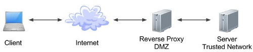

There are various server space applications available in the market. But the main and widely used ones are Apache Tomcat, Oracle WebLogic, and IBM Web Sphere. Let’s see what exactly WebLogic Server is. 

As mentioned on [Oracle's Page](https://docs.oracle.com/middleware/1213/wls/INTRO/intro.htm#INTRO123):
>
Oracle WebLogic Server is a scalable, Java Platform, Enterprise Edition (Java EE) Application Server. The WebLogic Server infrastructure supports the deployment of many types of distributed applications and is an ideal foundation for building applications based on Service Oriented Architectures (SOA).

In simpler terms, it provides a standard set of APIs to deploy and run, java based applications on distributed environment that can access a wide variety of services, such as databases, messaging services, and connections to external enterprise systems. End-user clients access these applications using Web or Java clients. 

It also supports the Spring Framework, a programming model for Java applications which provides an alternative to aspects of the Java EE model.

WebLogic Server provides complete support for the [Java EE 7.0 specification](http://www.oracle.com/technetwork/java/javaee/tech/index-jsp-142185.html):

- [Web Applications](https://docs.oracle.com/middleware/1213/wls/WBAPP/basics.htm#WBAPP117]) provide the basic Java EE mechanism for deployment of dynamic Web pages based on the Java EE standards of servlets and JavaServer Pages (JSP). Web applications are also used to serve static Web content such as HTML pages and image files.

- [Web Services](https://docs.oracle.com/middleware/1213/wls/WSGET/jax-ws-intro.htm#WSGET109) provide a shared set of functions that are available to other systems on a network and can be used as a component of distributed Web-based applications.

- [XML](https://docs.oracle.com/middleware/1213/wls/XMLPG/intro.htm#XMLPG131) capabilities include data exchange, and a means to store content independent of its presentation, and more.

- [Java Messaging Service](https://docs.oracle.com/middleware/1213/wls/JMSPG/fund.htm#JMSPG117) (JMS) enables applications to communicate with one another through the exchange of messages. A message is a request, report, and/or event that contains information needed to coordinate communication between different applications.

- [Java Database Connectivity](https://docs.oracle.com/middleware/1213/wls/JDBCA/config.htm#JDBCA115) (JDBC) provides pooled access to DBMS resources.

- [Resource Adapters](https://docs.oracle.com/middleware/1213/wls/ADAPT/understanding.htm#ADAPT115) provide connectivity to Enterprise Information Systems (EISes).

- [Enterprise JavaBeans](https://docs.oracle.com/middleware/1213/wls/EJBPG/understanding.htm#EJBPG118) (EJB) provide Java objects to encapsulate data and business logic.

- [Remote Method Invocation](https://docs.oracle.com/middleware/1213/wls/WLRMI/rmi_intro.htm#WLRMI109) (RMI) is the Java standard for distributed object computing, allowing applications to invoke methods on a remote object locally.

- [Security APIs](https://docs.oracle.com/middleware/1213/wls/SCPRG/intro.htm#SCPRG109) allow you to integrate authentication and authorization into your Java EE applications. You can also use the Security Provider APIs to create your own custom security providers.

- [WebLogic Tuxedo Connectivity](https://docs.oracle.com/middleware/1213/wls/WTCCF/intro.htm#WTCCF101) (WTC) provides interoperability between WebLogic Server applications and Tuxedo services. WTC allows WebLogic Server clients to invoke Tuxedo services and Tuxedo clients to invoke EJBs in response to a service request.

- [Coherence](https://docs.oracle.com/middleware/1213/wls/CLUST/coherence.htm#CLUST629) provides distributed caching and data grid capabilities for WebLogic Server applications.

- [Overview of WebLogic Server Application Development](https://docs.oracle.com/middleware/1213/wls/WLPRG/overview.htm#WLPRG107) describes developer tools and best practices for coding WebLogic Server applications.

In addition to the Java EE implementation, WebLogic Server enables enterprises to deploy mission-critical applications in a robust, secure, highly available, and scalable environment. These features allow enterprises to configure clusters of WebLogic Server instances to distribute load, and provide extra capacity in case of hardware or other failures. 

#### WebLogic Components

Once the installation of WebLogic and configuration of domain is done, Oracle WebLogic Admin Console is available to be accessed at **hostname:port/console**. After logging into the Admin console, all **Servers (Admin and Managed)** can be seen in the Servers section. 
 
 - **Servers**
   
   There are basically two types of servers, Admin and Managed Servers. These servers are configured to host the application and resources, like war, ear, jar, jdbc, jms. Each server has its own jvm whether Admin, NodeManager or Managed Server. A new concept called Dynamic Servers have been introduced with WebLogic 12C, which can automatically be spawned and services can be scaled up based upon configuration as load increases.

   - **Administration Server**
   
    Administration Server is always tied to a domain, and is central configuration controller for the entire domain. If there is need to do any modifcation, configuration change or manage resources in the domain, it is done through administration server.
   
    There can be only one, and always one administration server in a domain, i.e. a one-to-one relationship between administration server and domain. Administration Server can not spawn across domains.

    Administration Server instance hosts Administration Console. It enables to start/stop servers or migrate services within the domain. It also enables to deploy applications within the domain.

    In production, it is not recommended to host application logic or resources on the Administration Server.

   - **Managed Servers**

    Managed Server is the instance that hosts required applications and resources. There can be as many managed servers in a domain as required and each managed server is independent of other managed servers (unless they are in cluster).

   - **Admin and Managed Server Interaction**

    Admin Server stores the master copy of the domain configuration, including all managed servers domain configuration.

    Each managed server stores a local copy of its configuration. Whenever a managed server starts, it connects to admin server to synchronize the configuration. Hence any fresh configuration changes are passed on to managed servers on their next startup.

    For only first Managed Server startup, Admin Server must be running in order for Managed Server to be able to retrieve its domain configuration and store a local copy. After that Managed Server can run on its own, called as **Managed Server Independence (MSI Mode)**. 

    Admin Server can communicate to Managed Server directly, but Managed Server talks to Admin Server through a utility called as Node Manager for stopping and starting through Admin Console.

 - **Cluster**

   A single machine is not only a single point of failure, but also has finite capacity for traffic, that in practice can be troublesome for a busy application that is experiencing transient bursts in traffic.

   Cluster is a group of Managed Servers running simultanoeusly and working together to provide increased scalability and reliability. All managed servers in cluster, appears as a single instance to its clients. Cluster members can be on same or different hosts. Any configuration changes can be applied to all Cluster members by making changes to Cluster. 

   Cluster enables some advanced features such as Whole Server Migration, Service Migration, and clustered JMS destinations. Cluster communication is enabled either by unicast or multicast.

   Few guidelines for clusters are, all servers within a Clusters must also be in the same domain as well as at the same maintenence pack level. Though Clustered servers can be on same or different machines. And in one domain, there can be multiple clusters.

   - **Dynamic Cluster**
      
    A Cluster that contains one or more Dynamic Server, is referred to as Dynamic Cluster. In a Dynamic Cluster, Servers are scaled up automatically based upon the need of the Application.

    **Server Templates** are used to define configuration of Servers, which is used to create Servers dynamically in Dynamic Cluster.

#### WebLogic Administrator Tasks

There are many tasks performed by the WebLogic Administrator. Few considerable ones include, installation of weblogic and configuration of its domain. Deployment of applications, management and migration of domains from lower environments (test or development environment) to a production environment, troubleshooting issues and especially performance tuning, disaster recovery and management.

Admin must know some of the WebLogic server tools such as WebLogic server admin console, fusion middleware control, WebLogic scripting tool, SNMP agent, Apache ANT, control wizard, and RESTful management resource, etc. 

#### WebLogic Administrator Tools

- Admin Console
- Fusion Middleware Control
- WebLogic Scripting Tool (wlst)
- RESTful Management Resource
- Configuration Wizard
- Apache ANT
- SNMP Agent

Additionally, WebLogic Server supports applications developed using the [Spring Framework](http://www.springsource.org/), an open source application framework for the Java platform. [Developing and Administering Spring Applications for Oracle WebLogic Server](https://docs.oracle.com/middleware/1213/wls/SPRNG/toc.htm) provides an overview of Spring and WebLogic Server support for developing and deploying Spring applications. 

>
##### References: 
>
- [Oracle WebLogic Server Documentation](https://www.oracle.com/in/middleware/technologies/weblogic.html)
>
Few More Important Resources that can be checked out:
- [Books for Oracle WebLogic Server 12.1.3](https://docs.oracle.com/middleware/1213/wls/docs.htm)

  
