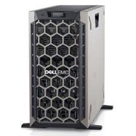
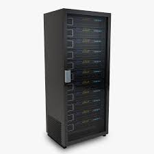
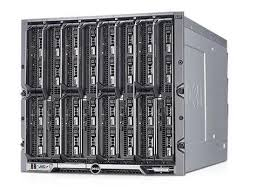

#### Tower Servers 

Tower servers are the most basic types of servers and these upright stand-alone units house all the standard server components, such as hard disks, motherboards, CPUs, networking and cabling inside a big hard cabinet, that often gives an outlook of a Tower PC.

They are big, very powerful and most configurable due to sufficient space and support for all required server components, and also have bundled software tools to manage them. 

The size also accounts for its downside over Rack or Blade as these are big in size, and due to Towered structure, they can not be stacked up one over the other. Moreover, cost of operation (power and network) is also high.

#### Rack Servers

These servers are smaller than that of tower servers and are mounted inside a Rack. A single rack can contain multiple servers along with additional devices. Major Racks available out there adhere to an IEEE standard and are measured in rack units or “U’s” (each U is 19” wide and 1.75” tall). So a rack server size is typically in multiplication of these “U’s”. There are many other electronic devices which adhere to this IEEE standard for instance – Rack Consoles, SAN devices, Power Backup devices, etc, advantage being that these can also be racked along with the servers as required.

This vertically scalable rack architecture makes it convenient to use and consume lesser space than that of a tower server. 

#### Blade Servers

Blade Servers are an additional level of innovation on top of Rack Servers. These servers are typically placed inside a blade enclosure, and together they form a Blade System. A blade system normally meets the IEEE standard of Rack Units, which means that the entire Blade system can be placed inside the rack along with other electronic equipments. The benefits of blade enclosure includes hot plugging (normally blade servers have a handle attached to them, for transferring them in and out of the blade enclosure) and stripped modular design (e.g. shared network ports, power connections, switches, etc). 

All these helps in further space reduction, cost savings (power, administration staff) and easy management. Bundle this with Virtualization and you have a very powerful infrastructure at your disposal.
